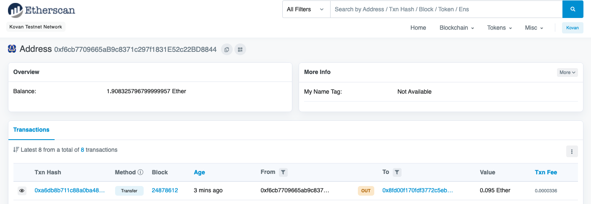

# Fintech Finder

This application enables customers to find and send cryptocurrency payments to fintech professionals. We have integrated an Ethereum blockchain network into the application in order to enable customers to instantly pay the fintech professionals whom they hire with cryptocurrency. To do this we will generate a new Ethereum account instance by using your mnemonic seed phrase, fetch and display the account balance associated with your Ethereum account address, calculate the total value of an Ethereum transaction, including the gas estimate, that pays a Fintech Finder candidate for their work, digitally sign a transaction that pays a Fintech Finder candidate, and send this transaction to the Kovan testnet, and review the transaction hash code associated with the validated blockchain transaction.


_Jo_


_Kendall_


---

## Technologies

This project uses Virtual Studio Code and the following python tools/libraries:

- Streamlit: to quickly turn Python scripts into shareable web apps and creating a user-friendly webpage interface for a blockchain.
- Dataclass: to offer ways of defining a custom data structure in Python. We can use a class to store multiple variables, or attributes.
- bip44: A Python implementation for deriving hierarchical deterministic wallets from a seed phrase based on the BIP-44 standard.
- Web3.py: A Python library for connecting to and performing operations on Ethereum-based blockchains.- ethereum-tester: A Python library that provides access to the tools we’ll use to test Ethereum-based applications.
- mnemonic: A Python implementation for generating a 12- or 24-word mnemonic seed phrase based on the BIP-39 standard.
- Infura API: An API that provides instant access to the Ethereum network over HTTPS (i.e., the web). You will need to create an account with Infura.


---

## Installation

Please install the following packages and libraries. Ensure that your dev enviroment is active, and then run the following install code:

```
pip install web3==5.17
```
```
pip install eth-tester
```
```
pip install mnemonic
```
```
pip install bip44
```

---

## Usage

To succesfully run the application, open the crypto_wallet.py and fintech_finder.py files and be sure the following dependencies and imports are run at the top of the python files:

```
import os
import requests
from dotenv import load_dotenv
load_dotenv()
from bip44 import Wallet
from web3 import Account
from web3.auto.infura.kovan import w3
from web3 import middleware
from web3.gas_strategies.time_based import medium_gas_price_strategy

import streamlit as st
from dataclasses import dataclass
from typing import Any, List
```

---

## Results

I decided on hiring Jo as my Fintech professional due to a near perfect rating with a reasonable hourly rate. It presented a happy medium, most bang for the buck.


_Transaction Details_


_Recipient's Balance_



_Sender's Balance_


## Contributors

Michael Husary was the main contributer along with the instructional staff. 

--- 
